# ether-http-jetty12

**Group:** `dev.rafex.ether.http` | **Artifact:** `ether-http-jetty12` | **Version:** `8.0.0-SNAPSHOT`

The primary module for building HTTP APIs with ether. This is the complete Jetty 12 transport implementation — everything from connector configuration and handler-chain wiring to JWT authentication, CORS, rate limiting, observability, and graceful shutdown lives here. If you are building an HTTP service with ether, this is the module you start with.

---

## Table of Contents

1. [What is ether-http-jetty12](#1-what-is-ether-http-jetty12)
2. [Maven Dependency](#2-maven-dependency)
3. [Architecture — Handler Chain](#3-architecture--handler-chain)
4. [Quick Start](#4-quick-start)
5. [Server Configuration](#5-server-configuration)
6. [Defining Routes](#6-defining-routes)
7. [Middleware](#7-middleware)
8. [Security](#8-security)
9. [Authentication](#9-authentication)
10. [Observability](#10-observability)
11. [Error Handling](#11-error-handling)
12. [Full Production Example](#12-full-production-example)

---

## 1. What is ether-http-jetty12

`ether-http-jetty12` is the Jetty 12 transport adapter for the ether framework. It wires the ether HTTP programming model — `HttpResource`, `HttpExchange`, `AuthPolicy`, `HttpSecurityProfile`, and the observability contracts — onto a real Jetty 12 `Server` instance. The module provides `JettyServerFactory`, a single factory class whose `create(...)` overloads handle all configuration concerns: building a `QueuedThreadPool`, wiring `ServerConnector` with a hardened `HttpConfiguration`, stacking the built-in security and observability handler chain, registering your routes via `JettyRouteRegistry`, and finally returning a `JettyServerRunner` that controls the server lifecycle. Built-in routes for `GET /hello` and `GET /health` are registered automatically unless you supply your own handlers at those paths.

---

## 2. Maven Dependency

```xml
<dependency>
    <groupId>dev.rafex.ether.http</groupId>
    <artifactId>ether-http-jetty12</artifactId>
    <version>8.0.0-SNAPSHOT</version>
</dependency>
```

Transitive dependencies brought in automatically:

| Module | Purpose |
|---|---|
| `ether-config` | Typed config loading from env / properties |
| `ether-http-core` | `HttpExchange`, `HttpResource`, `AuthPolicy`, `ErrorMapper` |
| `ether-http-security` | `HttpSecurityProfile`, CORS, headers, IP policy, rate limit |
| `ether-http-problem` | RFC 9457 Problem Details, `ProblemException` |
| `ether-json` | `JsonCodec` (serialisation / deserialisation) |
| `ether-observability-core` | `RequestIdGenerator`, `TimingRecorder`, `TimingSample` |
| `org.eclipse.jetty:jetty-server` | Jetty 12.1.x transport |

---

## 3. Architecture — Handler Chain

Every inbound HTTP request passes through a fixed handler chain assembled by `JettyServerFactory`. The chain order shown below reflects the actual wrapping order in the source — handlers listed first execute first on the way in and last on the way out.

```mermaid
graph TD
    Client(["HTTP Client"])
    Connector["ServerConnector\n(host, port, TLS config)"]
    SizeLimit["SizeLimitHandler\n(max request / response body bytes)"]
    QoS["QoSHandler\n(maxConcurrentRequests, suspend queue)"]
    ThreadLimit["ThreadLimitHandler\n(maxRequestsPerRemoteIp)"]
    Graceful["GracefulHandler\n(drains in-flight on shutdown)"]
    Observability["JettyObservabilityHandler\n- resolves / generates X-Request-Id\n- stores 'ether.request.id' attribute\n- records TimingSample on completion"]
    RateLimit["JettyRateLimitHandler\n- sliding-window per-IP or global\n- emits RateLimit-* headers\n- 429 on breach"]
    IpPolicy["JettyIpPolicyHandler\n- allow / deny by IP prefix\n- 403 on deny"]
    Cors["JettyCorsHandler\n- preflight handling\n- Origin allow / deny\n- injects CORS response headers"]
    SecurityHeaders["JettySecurityHeadersHandler\n- CSP, HSTS, X-Frame-Options, etc."]
    CustomMiddlewares["Custom JettyMiddlewares\n(your List&lt;JettyMiddleware&gt;, in order)"]
    Auth["JettyAuthHandler\n- validates Bearer JWT via TokenVerifier\n- stores auth context as 'auth' attribute\n- 401 on failure for protected prefixes"]
    Routing["PathMappingsHandler\n(Jetty path-spec routing)"]
    Handler["ResourceHandler / NonBlockingResourceHandler\n(your HttpResource code)"]

    Client --> Connector
    Connector --> SizeLimit
    SizeLimit --> QoS
    QoS --> ThreadLimit
    ThreadLimit --> Graceful
    Graceful --> Observability
    Observability --> RateLimit
    RateLimit --> IpPolicy
    IpPolicy --> Cors
    Cors --> SecurityHeaders
    SecurityHeaders --> CustomMiddlewares
    CustomMiddlewares --> Auth
    Auth --> Routing
    Routing --> Handler
```



> `SizeLimitHandler`, `QoSHandler`, and `ThreadLimitHandler` are only installed when the corresponding config values are non-zero. `JettyRateLimitHandler` is only installed when `RateLimitPolicy.isEnabled()` returns true.

### What each built-in layer does

| Handler | Responsibility |
|---|---|
| `JettyObservabilityHandler` | Propagates or generates a request ID; writes `X-Request-Id` response header; fires `TimingRecorder.record(TimingSample)` on request completion. |
| `JettyRateLimitHandler` | In-memory sliding-window rate limiter. Supports `GLOBAL` and `PER_IP` scopes. Sets `RateLimit-Limit`, `RateLimit-Remaining`, `RateLimit-Reset` headers on every response. |
| `JettyIpPolicyHandler` | Enforces `IpPolicy` allow/deny lists. Uses `TrustedProxyPolicy` to resolve the real client IP behind a proxy. Returns 403 with a Problem Details body on denial. |
| `JettyCorsHandler` | Handles `OPTIONS` preflight and adds `Access-Control-*` headers to all matching responses. Returns 403 for disallowed origins. |
| `JettySecurityHeadersHandler` | Applies `SecurityHeadersPolicy` — CSP, HSTS, `X-Frame-Options`, `X-Content-Type-Options`, `Referrer-Policy`, `Permissions-Policy`, `Cache-Control`, and any custom headers. |
| `JettyAuthHandler` | Validates `Authorization: Bearer <token>` via `TokenVerifier`. Stores the verified auth context object in the `"auth"` request attribute. Returns 401 with a Problem Details body when token is missing or invalid for protected prefixes. |

---

## 4. Quick Start

A minimal server with three routes and no authentication. Configuration is loaded from environment variables, and the server blocks until the JVM shuts down.

```java
import dev.rafex.ether.http.jetty12.*;
import dev.rafex.ether.http.core.*;
import dev.rafex.ether.json.JsonCodecBuilder;

import java.util.Map;
import java.util.Set;

public class QuickStartMain {

    public static void main(String[] args) throws Exception {

        // 1. Load server config from environment variables.
        //    Defaults: host=0.0.0.0, port=8080, maxThreads=max(cpus*2,16)
        var config = JettyServerConfig.fromEnv();

        // 2. Build a JSON codec (strict mode: unknown fields are rejected).
        var json = JsonCodecBuilder.strict().build();

        // 3. Register routes.
        var routes = new JettyRouteRegistry();

        // GET /ping  → { "pong": true }
        routes.add("/ping", new DelegatingResourceHandler("/ping", new PingResource(), json));

        // GET /items        → list
        // GET /items/{id}   → single item by path variable
        routes.add("/items", new DelegatingResourceHandler("/items", new ItemsResource(), json));

        // 4. Create and start the server. JettyServerRunner wraps the Jetty Server.
        var runner = JettyServerFactory.create(config, routes, json);
        runner.start();

        System.out.println("Listening on port " + config.port());

        // 5. Block the main thread until the server stops (SIGTERM triggers graceful shutdown).
        runner.await();
    }

    // --- Resources ---

    static class PingResource implements HttpResource {
        @Override
        public boolean get(HttpExchange x) {
            x.json(200, Map.of("pong", true));
            return true;
        }

        @Override
        public Set<String> supportedMethods() {
            return Set.of("GET");
        }
    }

    static class ItemsResource implements HttpResource {

        private static final Map<String, Map<String, Object>> STORE = Map.of(
            "1", Map.of("id", "1", "name", "Widget"),
            "2", Map.of("id", "2", "name", "Gadget")
        );

        @Override
        public boolean get(HttpExchange x) {
            var id = x.pathParam("id");   // null when path is /items (no variable)
            if (id != null) {
                var item = STORE.get(id);
                if (item == null) {
                    x.json(404, Map.of("error", "not_found"));
                } else {
                    x.json(200, item);
                }
            } else {
                x.json(200, STORE.values());
            }
            return true;
        }

        @Override
        public Set<String> supportedMethods() {
            return Set.of("GET");
        }
    }
}
```

The server automatically registers `GET /hello` and `GET /health` in addition to your routes.

---

## 5. Server Configuration

`JettyServerConfig` is a Java `record`. All fields have sensible defaults when loading from environment.

### Loading strategies

```java
// From environment variables (production default)
var config = JettyServerConfig.fromEnv();

// From a subset of env vars you supply programmatically (useful in tests)
var config = JettyServerConfig.fromEnv(Map.of("PORT", "9090", "HTTP_HOST", "127.0.0.1"));

// From ether-config (supports YAML, properties, env, etc.)
var etherConfig = EtherConfig.of(new MapConfigSource("app", map));
var config = JettyServerConfig.fromConfig(etherConfig);

// Direct constructor for full control (useful in tests)
var config = new JettyServerConfig(
    "0.0.0.0",   // host
    8080,        // port
    32,          // maxThreads
    4,           // minThreads
    30_000,      // idleTimeoutMs
    "my-app",    // threadPoolName
    "production",// environment
    128,         // acceptQueueSize
    true,        // reuseAddress
    true,        // stopAtShutdown
    30_000L,     // stopTimeoutMs
    1_000L,      // shutdownIdleTimeoutMs
    false,       // trustForwardHeaders
    false,       // forwardedOnly
    8_192,       // inputBufferSize
    32_768,      // outputBufferSize
    8_192,       // requestHeaderSize
    8_192,       // responseHeaderSize
    128L,        // minRequestDataRate (bytes/sec)
    0L,          // minResponseDataRate
    10,          // maxErrorDispatches
    8,           // maxUnconsumedRequestContentReads
    10L*1024*1024, // maxRequestBodyBytes (10 MB)
    -1L,         // maxResponseBodyBytes (-1 = unlimited)
    0,           // maxConcurrentRequests (0 = no QoS limit)
    1_024,       // maxSuspendedRequests
    30_000L,     // maxSuspendMs
    0            // maxRequestsPerRemoteIp (0 = no ThreadLimitHandler)
);
```

### Environment variable reference

| Environment Variable | Dot-notation key | Default | Notes |
|---|---|---|---|
| `HTTP_HOST` | `http.host` | _(any)_ | Blank = bind all interfaces |
| `PORT` / `HTTP_PORT` | `port` / `http.port` | `8080` | |
| `HTTP_MAX_THREADS` | `http.max.threads` | `max(cpus*2, 16)` | |
| `HTTP_MIN_THREADS` | `http.min.threads` | `4` | |
| `HTTP_IDLE_TIMEOUT_MS` | `http.idle.timeout.ms` | `30000` | |
| `HTTP_POOL_NAME` | `http.pool.name` | `ether-http` | Thread name prefix |
| `ENVIRONMENT` | `environment` | `unknown` | |
| `HTTP_ACCEPT_QUEUE_SIZE` | `http.accept.queue.size` | `128` | |
| `HTTP_STOP_AT_SHUTDOWN` | `http.stop.at.shutdown` | `true` | |
| `HTTP_STOP_TIMEOUT_MS` | `http.stop.timeout.ms` | `30000` | |
| `HTTP_SHUTDOWN_IDLE_TIMEOUT_MS` | `http.shutdown.idle.timeout.ms` | `1000` | GracefulHandler drain window |
| `HTTP_TRUST_FORWARDED_HEADERS` | `http.trust.forwarded.headers` | `false` | Enables ForwardedRequestCustomizer |
| `HTTP_FORWARDED_ONLY` | `http.forwarded.only` | `false` | RFC 7239 Forwarded header only |
| `HTTP_REQUEST_HEADER_SIZE` | `http.request.header.size` | `8192` | |
| `HTTP_MAX_REQUEST_BODY_BYTES` | `http.max.request.body.bytes` | `10485760` | 10 MB |
| `HTTP_MAX_RESPONSE_BODY_BYTES` | `http.max.response.body.bytes` | `-1` | Unlimited |
| `HTTP_MAX_CONCURRENT_REQUESTS` | `http.max.concurrent.requests` | `0` | Installs QoSHandler when > 0 |
| `HTTP_MAX_REQUESTS_PER_REMOTE_IP` | `http.max.requests.per.remote.ip` | `0` | Installs ThreadLimitHandler when > 0 |
| `HTTP_MIN_REQUEST_DATA_RATE` | `http.min.request.data.rate` | `128` | bytes/sec; closes slow clients |

---

## 6. Defining Routes

### The `HttpResource` interface

Your route logic lives in classes that implement `HttpResource`. Each HTTP method has a default implementation that returns 405 Method Not Allowed, so you only override what you need.

```java
import dev.rafex.ether.http.core.*;
import java.util.Map;
import java.util.Set;

// Handles GET /users and GET /users/{userId}
class UsersResource implements HttpResource {

    @Override
    public boolean get(HttpExchange x) {
        var userId = x.pathParam("userId");
        var page   = x.queryFirst("page");    // ?page=2
        var tags   = x.queryAll("tag");       // ?tag=admin&tag=staff

        if (userId != null) {
            // Single user
            x.json(200, Map.of("id", userId, "name", "Alice"));
        } else {
            // List with optional pagination
            int pageNum = page == null ? 1 : Integer.parseInt(page);
            x.json(200, Map.of("page", pageNum, "tags", tags, "users", java.util.List.of()));
        }
        return true;
    }

    @Override
    public boolean post(HttpExchange x) {
        // Read body: cast the exchange to JettyHttpExchange for Jetty-specific access,
        // or use your JsonCodec externally to parse the body bytes.
        x.json(201, Map.of("created", true));
        return true;
    }

    @Override
    public boolean delete(HttpExchange x) {
        var userId = x.pathParam("userId");
        x.noContent(204);
        return true;
    }

    @Override
    public Set<String> supportedMethods() {
        return Set.of("GET", "POST", "DELETE");
    }
}
```

### Registering routes

`JettyRouteRegistry.add(pathSpec, handler)` takes a Jetty path spec string and a Jetty `Handler`. Use `DelegatingResourceHandler` to bridge your `HttpResource` to a Jetty `Handler`.

```java
var routes = new JettyRouteRegistry();
var json   = JsonCodecBuilder.strict().build();

// Exact match
routes.add("/health", new DelegatingResourceHandler("/health", new MyHealthResource(), json));

// Prefix match with path variables parsed by ResourceHandler
routes.add("/users",  new DelegatingResourceHandler("/users",  new UsersResource(), json));

// The RouteMatcher inside ResourceHandler resolves sub-paths:
//   /users          → pathParam("userId") is null
//   /users/42       → pathParam("userId") == "42"
//   /users/42/roles → if you add Route.of("/{userId}/roles", ...) to routes()
```

### Path variables in ResourceHandler

`ResourceHandler` and `NonBlockingResourceHandler` call `RouteMatcher.match(relativePath, routes())`. The `routes()` method returns `List.of(Route.of("/", supportedMethods()))` by default. Override it to declare sub-paths with variables:

```java
class OrdersResource extends ResourceHandler {

    OrdersResource(JsonCodec json) { super(json); }

    @Override
    protected String basePath() { return "/orders"; }

    @Override
    protected java.util.List<dev.rafex.ether.http.core.Route> routes() {
        return java.util.List.of(
            dev.rafex.ether.http.core.Route.of("/",               Set.of("GET", "POST")),
            dev.rafex.ether.http.core.Route.of("/{orderId}",      Set.of("GET", "PUT", "DELETE")),
            dev.rafex.ether.http.core.Route.of("/{orderId}/lines",Set.of("GET", "POST"))
        );
    }

    @Override
    public boolean get(HttpExchange x) {
        var orderId = x.pathParam("orderId"); // null for /orders, present for /orders/123
        x.json(200, Map.of("orderId", orderId));
        return true;
    }

    @Override
    public Set<String> supportedMethods() { return Set.of("GET", "POST", "PUT", "DELETE"); }
}
```

Register it once — all sub-paths are handled internally:

```java
routes.add("/orders", new OrdersResource(json));
```

### Accessing Jetty internals from a handler

`JettyHttpExchange` exposes the underlying Jetty objects when you need request-level access beyond the `HttpExchange` API:

```java
@Override
public boolean get(HttpExchange x) throws Exception {
    // Downcast when inside a ResourceHandler where JettyHttpExchange is guaranteed
    if (x instanceof JettyHttpExchange jx) {
        var jettyRequest  = jx.request();   // org.eclipse.jetty.server.Request
        var jettyResponse = jx.response();  // org.eclipse.jetty.server.Response
        var callback      = jx.callback();  // org.eclipse.jetty.util.Callback

        // e.g. read auth context placed by JettyAuthHandler
        var auth = (MyPrincipal) jettyRequest.getAttribute(JettyAuthHandler.REQ_ATTR_AUTH);
        var requestId = (String) jettyRequest.getAttribute(JettyObservabilityHandler.REQUEST_ID_ATTRIBUTE);
    }
    x.json(200, Map.of("ok", true));
    return true;
}
```

---

## 7. Middleware

### The `JettyMiddleware` interface

`JettyMiddleware` is a `@FunctionalInterface` with a single method:

```java
@FunctionalInterface
public interface JettyMiddleware {
    Handler wrap(Handler next);
}
```

A middleware receives the next handler in the chain and returns a new handler that wraps it. This mirrors the standard Jetty `Handler.Wrapper` pattern.

### Writing a custom middleware

```java
import org.eclipse.jetty.server.Handler;
import org.eclipse.jetty.server.Request;
import org.eclipse.jetty.server.Response;
import org.eclipse.jetty.util.Callback;

import dev.rafex.ether.http.jetty12.JettyMiddleware;
import dev.rafex.ether.http.jetty12.JettyObservabilityHandler;

// Logs METHOD path requestId durationMs to stdout on every request.
JettyMiddleware requestLogger = next -> new Handler.Wrapper(next) {
    @Override
    public boolean handle(Request request, Response response, Callback callback) throws Exception {
        var start = System.nanoTime();
        try {
            return super.handle(request, response, callback);
        } finally {
            var elapsed = (System.nanoTime() - start) / 1_000_000;
            var requestId = request.getAttribute(JettyObservabilityHandler.REQUEST_ID_ATTRIBUTE);
            System.out.printf("%s %s %s %dms%n",
                request.getMethod(),
                request.getHttpURI().getPath(),
                requestId,
                elapsed);
        }
    }
};
```

### Registering middlewares

Pass middlewares to `JettyServerFactory.create(...)`:

```java
var runner = JettyServerFactory.create(
    config,
    routeRegistry,
    json,
    tokenVerifier,
    authPolicies,
    List.of(requestLogger, anotherMiddleware)  // custom middlewares
);
```

Or use `JettyMiddlewareRegistry` when working with `JettyModule`:

```java
@Override
public void registerMiddlewares(JettyMiddlewareRegistry middlewares, JettyModuleContext ctx) {
    middlewares.add(requestLogger);
}
```

### Chain order

Custom middlewares are applied **after** the built-in security and observability stack. Within your list, they are applied in list order — index 0 is outermost (executes first on request, last on response). The resulting full chain:

```
JettyObservabilityHandler
  → [JettyRateLimitHandler (if enabled)]
    → JettyIpPolicyHandler
      → JettyCorsHandler
        → JettySecurityHeadersHandler
          → middlewares[0]          ← your first custom middleware (outermost)
            → middlewares[1]
              → ...
                → JettyAuthHandler (if token verifier + auth policies supplied)
                  → PathMappingsHandler
                    → ResourceHandler (your code)
```

---

## 8. Security

All security behaviour is configured through `HttpSecurityProfile`, a record that bundles five independent policies.

```java
import dev.rafex.ether.http.security.profile.HttpSecurityProfile;
import dev.rafex.ether.http.security.cors.CorsPolicy;
import dev.rafex.ether.http.security.headers.SecurityHeadersPolicy;
import dev.rafex.ether.http.security.ip.IpPolicy;
import dev.rafex.ether.http.security.proxy.TrustedProxyPolicy;
import dev.rafex.ether.http.security.ratelimit.RateLimitPolicy;
```

### CORS — `CorsPolicy`

```java
// Strict: only listed origins
var cors = CorsPolicy.strict(List.of(
    "https://app.example.com",
    "https://admin.example.com"
));

// Permissive: allow any origin (useful for public APIs)
var cors = CorsPolicy.permissive();

// Custom policy with credentials allowed
var cors = new CorsPolicy(
    false,                                              // allowAnyOrigin
    List.of("https://app.example.com"),                 // allowedOrigins
    List.of("GET","POST","PUT","DELETE","OPTIONS"),      // allowedMethods
    List.of("content-type","authorization","x-api-key"),// allowedHeaders
    List.of("x-request-id"),                            // exposedHeaders
    true,                                               // allowCredentials
    7200,                                               // maxAgeSeconds
    true                                                // varyOrigin
);
```

Response headers injected by `JettyCorsHandler`:

| Header | Source |
|---|---|
| `Access-Control-Allow-Origin` | Matched origin or `*` |
| `Access-Control-Allow-Methods` | `allowedMethods` |
| `Access-Control-Allow-Headers` | `allowedHeaders` |
| `Access-Control-Expose-Headers` | `exposedHeaders` (if non-empty) |
| `Access-Control-Allow-Credentials` | `"true"` if `allowCredentials` |
| `Access-Control-Max-Age` | `maxAgeSeconds` |
| `Vary` | `Origin` if `varyOrigin` |

### Security Headers — `SecurityHeadersPolicy`

```java
// Defaults: all hardening headers enabled, CSP = "default-src 'self'; frame-ancestors 'none'; base-uri 'self'"
var headers = SecurityHeadersPolicy.defaults();

// Custom: disable HSTS (e.g. local/dev), custom CSP, add a custom header
var headers = new SecurityHeadersPolicy(
    true,   // X-Content-Type-Options: nosniff
    true,   // X-Frame-Options: DENY
    true,   // Referrer-Policy: no-referrer
    true,   // Permissions-Policy: geolocation=(), microphone=(), camera=()
    false,  // Strict-Transport-Security (disabled for non-HTTPS environments)
    true,   // Cache-Control: no-store
    "default-src 'self'; script-src 'self' https://cdn.example.com",
    Map.of("X-Custom-Header", "my-value")
);
```

### IP Policy — `IpPolicy`

```java
// Allow all (default)
var ip = IpPolicy.allowAll();

// Allow only internal subnets
var ip = new IpPolicy(
    List.of("10.0.", "192.168.1."),   // allowList (prefix match)
    List.of()                          // denyList
);

// Allow all, but deny known bad actors
var ip = new IpPolicy(
    List.of(),                         // empty allowList = allow all that aren't denied
    List.of("203.0.113.", "198.51.100.42")
);
```

`IpPolicy.isAllowed(ip)` checks deny list first, then allow list. An empty allow list means "allow everything not denied".

### Rate Limiting — `RateLimitPolicy`

```java
// 100 requests per minute per IP, burst of 20, max 50 concurrent
var rateLimit = new RateLimitPolicy(
    RateLimitPolicy.Scope.PER_IP,   // or GLOBAL
    100,    // maxRequests per window
    60,     // windowSeconds
    20,     // burst (added on top of maxRequests)
    50      // maxConcurrentRequests (also drives QoSHandler)
);

// Disabled (default)
var rateLimit = new RateLimitPolicy(RateLimitPolicy.Scope.GLOBAL, 0, 0, 0, 0);
```

`JettyRateLimitHandler` is only installed when `rateLimit.isEnabled()` returns true (`maxRequests > 0 && windowSeconds > 0`). The handler uses an in-memory sliding-window counter.

### Trusted Proxy — `TrustedProxyPolicy`

Required for correct IP resolution when your service sits behind a load balancer:

```java
var trustedProxies = new TrustedProxyPolicy(
    List.of("10.0.0.", "172.16."),  // trusted proxy CIDRs / prefixes
    true,   // trustForwardedHeader (enables ForwardedRequestCustomizer)
    false,  // forwardedOnly (false = also trust X-Forwarded-For)
    true    // enabled
);

// Disabled (direct connection, no proxy)
var trustedProxies = TrustedProxyPolicy.disabled();
```

### Assembling the full profile

```java
var securityProfile = new HttpSecurityProfile(
    cors,
    headers,
    trustedProxies,
    ip,
    rateLimit
);

var runner = JettyServerFactory.create(
    config,
    routeRegistry,
    json,
    tokenVerifier,
    authPolicies,
    List.of(),           // custom middlewares
    securityProfile,
    new UuidRequestIdGenerator(),
    timingRecorder
);
```

---

## 9. Authentication

### `TokenVerifier`

`TokenVerifier` is a `@FunctionalInterface` that bridges any token validation library (JWT, opaque tokens, API keys) into the ether auth pipeline:

```java
@FunctionalInterface
public interface TokenVerifier {
    TokenVerificationResult verify(String token, long epochSeconds);
}
```

`TokenVerificationResult` is a record:

```java
// Success — context is stored as the "auth" request attribute
TokenVerificationResult.ok(myPrincipal)

// Failure — code is surfaced in the 401 Problem Details response
TokenVerificationResult.failed("token_expired")
TokenVerificationResult.failed("invalid_signature")
```

### Implementing `TokenVerifier`

```java
record UserPrincipal(String userId, String role) {}

// Example using ether-jwt or any JJWT/Nimbus implementation:
TokenVerifier tokenVerifier = (token, epochSeconds) -> {
    try {
        var claims = JwtParser.parse(token, secretKey);  // your JWT library
        if (claims.expiration() < epochSeconds) {
            return TokenVerificationResult.failed("token_expired");
        }
        var principal = new UserPrincipal(claims.subject(), claims.get("role", String.class));
        return TokenVerificationResult.ok(principal);
    } catch (Exception e) {
        return TokenVerificationResult.failed("invalid_token");
    }
};
```

### `AuthPolicy` — public paths and protected prefixes

`AuthPolicy` declares which routes require authentication:

```java
import dev.rafex.ether.http.core.AuthPolicy;

var authPolicies = List.of(
    // These specific method+path combinations bypass auth
    AuthPolicy.publicPath("GET",  "/health"),
    AuthPolicy.publicPath("GET",  "/hello"),
    AuthPolicy.publicPath("POST", "/auth/login"),
    AuthPolicy.publicPath("GET",  "/docs/*"),

    // Everything under /api requires a valid Bearer token
    AuthPolicy.protectedPrefix("/api/*")
);
```

`JettyAuthHandler` evaluates policies in order:
1. If the request matches any `PUBLIC_PATH` rule (method + path spec) → pass through without auth.
2. If the path matches any `PROTECTED_PREFIX` spec → require and validate the Bearer token.
3. Paths matching neither rule → pass through (not protected by default).

### Accessing the auth context in your handler

```java
@Override
public boolean get(HttpExchange x) {
    if (x instanceof JettyHttpExchange jx) {
        // JettyAuthHandler stores the verified context object under the "auth" attribute
        var principal = (UserPrincipal) jx.request().getAttribute(JettyAuthHandler.REQ_ATTR_AUTH);
        if (principal == null) {
            x.json(401, Map.of("error", "unauthenticated"));
            return true;
        }

        // Role-based access control
        if (!"admin".equals(principal.role())) {
            x.json(403, Map.of("error", "insufficient_role"));
            return true;
        }

        x.json(200, Map.of("userId", principal.userId(), "role", principal.role()));
    }
    return true;
}
```

### Using `JettyAuthPolicyRegistry` with `JettyModule`

When you use the module-based factory overload, register auth policies via `JettyAuthPolicyRegistry`:

```java
public class ApiModule implements JettyModule {

    @Override
    public void registerRoutes(JettyRouteRegistry routes, JettyModuleContext ctx) {
        routes.add("/api/users",   new UsersHandler(ctx.jsonCodec()));
        routes.add("/api/reports", new ReportsHandler(ctx.jsonCodec()));
    }

    @Override
    public void registerAuthPolicies(JettyAuthPolicyRegistry auth, JettyModuleContext ctx) {
        auth.publicPath("GET", "/health");
        auth.publicPath("GET", "/hello");
        auth.protectedPrefix("/api/*");
    }
}
```

---

## 10. Observability

### Request IDs

`JettyObservabilityHandler` assigns a request ID to every request:

1. If the incoming request has an `X-Request-Id` header, that value is reused.
2. Otherwise the `RequestIdGenerator` produces a new ID.

The ID is stored in two places:
- Request attribute `"ether.request.id"` (accessible anywhere in the handler chain via `request.getAttribute(JettyObservabilityHandler.REQUEST_ID_ATTRIBUTE)`)
- `X-Request-Id` response header (automatically sent to clients)

**Custom `RequestIdGenerator`:**

```java
import dev.rafex.ether.observability.core.request.RequestIdGenerator;
import java.util.concurrent.atomic.AtomicLong;

// Monotonic counter instead of UUID — faster and more compact
RequestIdGenerator counter = new RequestIdGenerator() {
    private final AtomicLong seq = new AtomicLong(0);

    @Override
    public String nextId() {
        return "req-" + seq.incrementAndGet();
    }
};

// Pass it to the factory
var runner = JettyServerFactory.create(
    config, routeRegistry, json,
    tokenVerifier, authPolicies, middlewares,
    securityProfile,
    counter,       // <-- custom generator
    timingRecorder
);
```

### Timing

`TimingRecorder` is a `@FunctionalInterface` called once per request, after the response is fully written:

```java
@FunctionalInterface
public interface TimingRecorder {
    void record(TimingSample sample);
}
```

`TimingSample` provides:

```java
record TimingSample(String name, Instant startedAt, Instant finishedAt) {
    Duration duration() { ... }
}
```

The `name` field is `"METHOD /path"` (e.g. `"GET /api/users/42"`).

**Custom `TimingRecorder` examples:**

```java
// Log slow requests to stderr
TimingRecorder slowLogger = sample -> {
    var ms = sample.duration().toMillis();
    if (ms > 500) {
        System.err.printf("[SLOW] %s took %dms%n", sample.name(), ms);
    }
};

// Push to a metrics system (e.g. Micrometer, Prometheus)
TimingRecorder metricsRecorder = sample -> {
    meterRegistry.timer("http.request.duration",
        "route", sample.name())
        .record(sample.duration());
};

// Collect for tests
var timings = new java.util.concurrent.CopyOnWriteArrayList<TimingSample>();
TimingRecorder collectingRecorder = timings::add;

// No-op (built-in default when you don't supply one)
TimingRecorder noOp = sample -> {};
```

---

## 11. Error Handling

### Default error mapping

`ResourceHandler` and `NonBlockingResourceHandler` catch all exceptions thrown by your `HttpResource` methods. The default `DefaultErrorMapper` maps any uncaught exception to HTTP 500 with a generic error body.

### `ProblemException` — RFC 9457 Problem Details

Throw `ProblemException` from any handler method to produce a structured Problem Details response:

```java
import dev.rafex.ether.http.problem.exception.ProblemException;
import dev.rafex.ether.http.problem.model.ProblemDetails;

@Override
public boolean post(HttpExchange x) throws Exception {
    var input = parseBody(x);  // your parsing logic
    if (input == null) {
        throw new ProblemException(ProblemDetails.builder()
            .status(422)
            .title("Validation Failed")
            .detail("The 'name' field is required")
            .property("code", "validation_error")
            .property("field", "name")
            .build());
    }
    // ... process and respond
    x.json(201, Map.of("id", "new-id"));
    return true;
}
```

The handler catches `ProblemException` before the general `Exception` catch and writes the problem body directly using `JettyApiErrorResponses.problem(...)`.

### `ProblemHttpErrorMapper`

To make your custom domain exceptions produce Problem Details bodies, use `ProblemHttpErrorMapper` as the `ErrorMapper` in your `ResourceHandler`:

```java
class OrdersResource extends ResourceHandler {

    OrdersResource(JsonCodec json) {
        // ProblemHttpErrorMapper falls back to DefaultErrorMapper for unknown exceptions
        super(json, new ProblemHttpErrorMapper());
    }

    @Override
    protected String basePath() { return "/orders"; }

    @Override
    public boolean post(HttpExchange x) throws Exception {
        // If this throws a ProblemException, ProblemHttpErrorMapper surfaces it as
        // a Problem Details JSON body with the correct HTTP status.
        // Other exceptions become 500 Internal Server Error.
        orderService.createOrder(parseBody(x));
        x.json(201, Map.of("created", true));
        return true;
    }

    @Override
    public Set<String> supportedMethods() { return Set.of("POST"); }
}
```

### `JettyApiErrorResponses` — direct error responses

For handlers that don't extend `ResourceHandler`, or when you need to emit errors directly from middleware, use `JettyApiErrorResponses`:

```java
var errorResponses = new JettyApiErrorResponses(jsonCodec);

// 400 Bad Request
errorResponses.badRequest(response, callback, "missing_required_field");

// 401 Unauthorized
errorResponses.unauthorized(response, callback, "token_expired");

// 403 Forbidden
errorResponses.forbidden(response, callback, "ip_not_allowed");

// 404 Not Found
errorResponses.notFound(response, callback, "/api/orders/999");

// 500 Internal Server Error
errorResponses.internalServerError(response, callback, "database_unavailable");

// Custom status + Problem Details
errorResponses.error(response, callback, 422, "validation_error", "field_required",
    "The email field is required", "/api/users");

// From a pre-built ProblemDetails
errorResponses.problem(response, callback, myProblemDetails);
```

All error responses are serialised as RFC 9457 Problem Details JSON with a `type` URI of `https://rafex.dev/problems/{error}`.

---

## 12. Full Production Example

A complete `main()` method demonstrating a production-grade server with CORS, security headers, JWT authentication with role checks, custom middleware, custom timing recorder, multiple routes, and graceful shutdown.

```java
package com.example.myservice;

import dev.rafex.ether.http.core.*;
import dev.rafex.ether.http.jetty12.*;
import dev.rafex.ether.http.problem.exception.ProblemException;
import dev.rafex.ether.http.problem.mapper.ProblemHttpErrorMapper;
import dev.rafex.ether.http.problem.model.ProblemDetails;
import dev.rafex.ether.http.security.cors.CorsPolicy;
import dev.rafex.ether.http.security.headers.SecurityHeadersPolicy;
import dev.rafex.ether.http.security.ip.IpPolicy;
import dev.rafex.ether.http.security.profile.HttpSecurityProfile;
import dev.rafex.ether.http.security.proxy.TrustedProxyPolicy;
import dev.rafex.ether.http.security.ratelimit.RateLimitPolicy;
import dev.rafex.ether.json.JsonCodecBuilder;
import dev.rafex.ether.observability.core.request.UuidRequestIdGenerator;
import dev.rafex.ether.observability.core.timing.TimingRecorder;

import org.eclipse.jetty.server.Handler;
import org.eclipse.jetty.server.Request;
import org.eclipse.jetty.server.Response;
import org.eclipse.jetty.util.Callback;

import java.util.List;
import java.util.Map;
import java.util.Set;
import java.util.concurrent.atomic.LongAdder;

public class ProductionMain {

    // -----------------------------------------------------------------------
    // Simulated principal (populated by TokenVerifier on successful auth)
    // -----------------------------------------------------------------------
    record Principal(String userId, String role) {}

    // -----------------------------------------------------------------------
    // main
    // -----------------------------------------------------------------------
    public static void main(String[] args) throws Exception {

        // --- Config from env vars -------------------------------------------
        var config = JettyServerConfig.fromEnv();

        // --- JSON codec -------------------------------------------------------
        var json = JsonCodecBuilder.strict().build();

        // --- TokenVerifier ---------------------------------------------------
        // Replace the body with your real JWT library (ether-jwt, JJWT, Nimbus, etc.)
        TokenVerifier tokenVerifier = (token, epochSeconds) -> {
            if ("secret-admin-token".equals(token)) {
                return TokenVerificationResult.ok(new Principal("u-001", "admin"));
            }
            if ("secret-user-token".equals(token)) {
                return TokenVerificationResult.ok(new Principal("u-002", "user"));
            }
            return TokenVerificationResult.failed("invalid_token");
        };

        // --- Auth policies ---------------------------------------------------
        var authPolicies = List.of(
            AuthPolicy.publicPath("GET",  "/health"),
            AuthPolicy.publicPath("GET",  "/hello"),
            AuthPolicy.publicPath("POST", "/api/v1/auth/login"),
            AuthPolicy.protectedPrefix("/api/*")
        );

        // --- Security profile ------------------------------------------------
        var cors = CorsPolicy.strict(List.of(
            "https://app.example.com",
            "https://admin.example.com"
        ));

        var securityHeaders = new SecurityHeadersPolicy(
            true, true, true, true,
            true,   // HSTS — enable only when serving over TLS
            true,
            "default-src 'self'; img-src 'self' data:; style-src 'self' 'unsafe-inline'",
            Map.of("X-Service-Version", "8.0.0")
        );

        var trustedProxies = new TrustedProxyPolicy(
            List.of("10.0.", "172.16."), // load balancer subnets
            true,   // trust X-Forwarded-For
            false,  // also accept RFC 7239 Forwarded
            true
        );

        var ipPolicy = new IpPolicy(
            List.of(),                  // allowList empty = allow all
            List.of("192.0.2.")         // deny TEST-NET-1 (example)
        );

        var rateLimit = new RateLimitPolicy(
            RateLimitPolicy.Scope.PER_IP,
            200,    // maxRequests per window
            60,     // windowSeconds
            50,     // burst
            500     // maxConcurrentRequests (also caps QoSHandler)
        );

        var securityProfile = new HttpSecurityProfile(
            cors, securityHeaders, trustedProxies, ipPolicy, rateLimit
        );

        // --- Custom timing recorder ------------------------------------------
        var requestCount = new LongAdder();
        var slowCount    = new LongAdder();

        TimingRecorder timingRecorder = sample -> {
            requestCount.increment();
            var ms = sample.duration().toMillis();
            if (ms > 1_000) {
                slowCount.increment();
                System.err.printf("[SLOW REQUEST] %s — %dms (total slow: %d)%n",
                    sample.name(), ms, slowCount.longValue());
            }
        };

        // --- Custom middleware: structured access log ------------------------
        JettyMiddleware accessLog = next -> new Handler.Wrapper(next) {
            @Override
            public boolean handle(Request req, Response res, Callback cb) throws Exception {
                var start = System.nanoTime();
                try {
                    return super.handle(req, res, cb);
                } finally {
                    var ms = (System.nanoTime() - start) / 1_000_000L;
                    var reqId = req.getAttribute(JettyObservabilityHandler.REQUEST_ID_ATTRIBUTE);
                    System.out.printf(
                        "{\"level\":\"INFO\",\"msg\":\"request\",\"method\":\"%s\"," +
                        "\"path\":\"%s\",\"requestId\":\"%s\",\"durationMs\":%d}%n",
                        req.getMethod(),
                        req.getHttpURI().getPath(),
                        reqId,
                        ms
                    );
                }
            }
        };

        // --- Route registry --------------------------------------------------
        var routes = new JettyRouteRegistry();

        // Public routes
        routes.add("/api/v1/auth/login",
            new DelegatingResourceHandler("/api/v1/auth/login", new LoginResource(), json));

        // Protected routes (requires valid JWT via authPolicies above)
        routes.add("/api/v1/users",
            new DelegatingResourceHandler("/api/v1/users", new UsersResource(), json));

        routes.add("/api/v1/admin/reports",
            new DelegatingResourceHandler("/api/v1/admin/reports", new AdminReportsResource(), json));

        // --- Build and start server ------------------------------------------
        var runner = JettyServerFactory.create(
            config,
            routes,
            json,
            tokenVerifier,
            authPolicies,
            List.of(accessLog),
            securityProfile,
            new UuidRequestIdGenerator(),
            timingRecorder
        );

        runner.start();

        System.out.printf(
            "{\"level\":\"INFO\",\"msg\":\"server started\",\"host\":\"%s\",\"port\":%d}%n",
            config.host() == null ? "0.0.0.0" : config.host(),
            config.port()
        );

        // Block until SIGTERM / SIGINT — JettyServerRunner honours
        // config.stopAtShutdown() which defaults to true, so Jetty registers
        // its own shutdown hook. await() joins the server thread.
        runner.await();

        System.out.printf(
            "{\"level\":\"INFO\",\"msg\":\"server stopped\",\"totalRequests\":%d,\"slowRequests\":%d}%n",
            requestCount.longValue(),
            slowCount.longValue()
        );
    }

    // -----------------------------------------------------------------------
    // Resources
    // -----------------------------------------------------------------------

    /** POST /api/v1/auth/login — public, returns a fake token */
    static class LoginResource implements HttpResource {
        @Override
        public boolean post(HttpExchange x) {
            // In production: validate credentials, issue a real JWT
            x.json(200, Map.of("token", "secret-user-token", "role", "user"));
            return true;
        }

        @Override
        public Set<String> supportedMethods() { return Set.of("POST"); }
    }

    /** GET /api/v1/users — protected, any authenticated user */
    static class UsersResource implements HttpResource {
        @Override
        public boolean get(HttpExchange x) {
            // Access the auth context placed by JettyAuthHandler
            if (x instanceof JettyHttpExchange jx) {
                var principal = (Principal) jx.request().getAttribute(JettyAuthHandler.REQ_ATTR_AUTH);
                x.json(200, Map.of(
                    "requestedBy", principal == null ? "unknown" : principal.userId(),
                    "users",       List.of(Map.of("id", "u-001"), Map.of("id", "u-002"))
                ));
            }
            return true;
        }

        @Override
        public Set<String> supportedMethods() { return Set.of("GET"); }
    }

    /**
     * GET /api/v1/admin/reports — protected, admin role only.
     * Extends ResourceHandler to get ProblemException support out of the box.
     */
    static class AdminReportsResource extends ResourceHandler {

        AdminReportsResource() {
            super(JsonCodecBuilder.strict().build(), new ProblemHttpErrorMapper());
        }

        @Override
        protected String basePath() { return "/api/v1/admin/reports"; }

        @Override
        public boolean get(HttpExchange x) throws Exception {
            if (x instanceof JettyHttpExchange jx) {
                var principal = (Principal) jx.request().getAttribute(JettyAuthHandler.REQ_ATTR_AUTH);

                if (principal == null || !"admin".equals(principal.role())) {
                    // ProblemException is caught by ResourceHandler and rendered as
                    // a proper Problem Details body.
                    throw new ProblemException(ProblemDetails.builder()
                        .status(403)
                        .title("Forbidden")
                        .detail("Admin role required to access reports")
                        .property("code", "insufficient_role")
                        .property("requiredRole", "admin")
                        .build());
                }

                var format = x.queryFirst("format");   // e.g. ?format=csv
                var report = switch (format == null ? "json" : format) {
                    case "csv"  -> Map.of("format", "csv",  "data", "id,name\n1,Widget");
                    case "json" -> Map.of("format", "json", "data", List.of(Map.of("id", 1, "name", "Widget")));
                    default     -> throw new ProblemException(ProblemDetails.builder()
                        .status(400)
                        .title("Bad Request")
                        .detail("Unsupported format: " + format)
                        .property("code", "unsupported_format")
                        .property("supported", List.of("json", "csv"))
                        .build());
                };

                x.json(200, report);
            }
            return true;
        }

        @Override
        public Set<String> supportedMethods() { return Set.of("GET"); }
    }
}
```

### Running with environment variables

```bash
# Minimal
PORT=8080 java -jar my-service.jar

# Production with tuned thread pool and proxy support
HTTP_HOST=0.0.0.0 \
PORT=8080 \
HTTP_MAX_THREADS=64 \
HTTP_MIN_THREADS=8 \
HTTP_STOP_TIMEOUT_MS=30000 \
HTTP_TRUST_FORWARDED_HEADERS=true \
HTTP_MAX_REQUEST_BODY_BYTES=5242880 \
HTTP_MAX_CONCURRENT_REQUESTS=1000 \
ENVIRONMENT=production \
java -jar my-service.jar
```

### Graceful shutdown sequence

When the JVM receives SIGTERM:

1. Jetty's built-in shutdown hook (enabled by `stopAtShutdown=true`) calls `server.stop()`.
2. `GracefulHandler` drains in-flight requests, waiting up to `shutdownIdleTimeoutMs` (default 1 s) for them to complete.
3. `QueuedThreadPool` is stopped after the connector closes.
4. `runner.await()` returns and `main()` exits cleanly.

`JettyServerRunner` also exposes `stop()` directly if you need programmatic control:

```java
// Register your own shutdown hook
Runtime.getRuntime().addShutdownHook(new Thread(() -> {
    try {
        System.out.println("Shutting down ...");
        runner.stop();
    } catch (Exception e) {
        e.printStackTrace();
    }
}));

runner.start();
runner.await();
```

---

## Class Reference Summary

| Class | Package | Role |
|---|---|---|
| `JettyServerFactory` | `dev.rafex.ether.http.jetty12` | Main entry point. Static `create(...)` overloads assemble and return `JettyServerRunner`. |
| `JettyServerRunner` | `dev.rafex.ether.http.jetty12` | Wraps `org.eclipse.jetty.server.Server`. Provides `start()`, `stop()`, `await()`, `server()`. |
| `JettyServerConfig` | `dev.rafex.ether.http.jetty12` | Record holding all server knobs. Loaded via `fromEnv()`, `fromConfig(EtherConfig)`, or direct construction. |
| `JettyRouteRegistry` | `dev.rafex.ether.http.jetty12` | Mutable list of `(pathSpec, Handler)` registrations. |
| `JettyMiddleware` | `dev.rafex.ether.http.jetty12` | `@FunctionalInterface` — `Handler wrap(Handler next)`. |
| `JettyMiddlewareRegistry` | `dev.rafex.ether.http.jetty12` | Ordered list of `JettyMiddleware` used by `JettyModule`. |
| `JettyAuthPolicyRegistry` | `dev.rafex.ether.http.jetty12` | List of `AuthPolicy` used by `JettyModule`. |
| `JettyModule` | `dev.rafex.ether.http.jetty12` | Interface — implement to group routes + auth policies + middlewares. |
| `JettyModuleContext` | `dev.rafex.ether.http.jetty12` | Record passed to `JettyModule` methods — carries config, codec, verifier, profile, etc. |
| `JettyHttpExchange` | `dev.rafex.ether.http.jetty12` | Implements `HttpExchange`. Wraps Jetty `Request/Response/Callback`. Exposes `request()`, `response()`, `callback()`. |
| `ResourceHandler` | `dev.rafex.ether.http.jetty12` | Abstract blocking `Handler` that implements `HttpResource`. Extend for blocking I/O handlers. |
| `NonBlockingResourceHandler` | `dev.rafex.ether.http.jetty12` | Abstract non-blocking variant (`Handler.Abstract.NonBlocking`). Extend for CPU-bound or async handlers. |
| `DelegatingResourceHandler` | `dev.rafex.ether.http.jetty12` | Package-private. Bridges a plain `HttpResource` into a `ResourceHandler`. Used internally and by `JettyBuiltinModule`. |
| `TokenVerifier` | `dev.rafex.ether.http.jetty12` | `@FunctionalInterface` — `TokenVerificationResult verify(String token, long epochSeconds)`. |
| `TokenVerificationResult` | `dev.rafex.ether.http.jetty12` | Record — `ok(Object context)` / `failed(String code)`. |
| `JettyAuthHandler` | `dev.rafex.ether.http.jetty12` | Validates Bearer tokens. Stores auth context as `"auth"` request attribute. |
| `JettyCorsHandler` | `dev.rafex.ether.http.jetty12` | Applies `CorsPolicy`. Handles preflight. |
| `JettySecurityHeadersHandler` | `dev.rafex.ether.http.jetty12` | Applies `SecurityHeadersPolicy` headers. |
| `JettyIpPolicyHandler` | `dev.rafex.ether.http.jetty12` | Enforces `IpPolicy`. |
| `JettyRateLimitHandler` | `dev.rafex.ether.http.jetty12` | In-memory sliding-window rate limiter. |
| `JettyObservabilityHandler` | `dev.rafex.ether.http.jetty12` | Request ID propagation + timing. |
| `JettyApiErrorResponses` | `dev.rafex.ether.http.jetty12` | Helper for writing Problem Details error responses directly to a Jetty `Response`. |
| `JettyApiResponses` | `dev.rafex.ether.http.jetty12` | Helper for writing JSON / text / no-content responses. |

---

## License

MIT — see [LICENSE](LICENSE)
